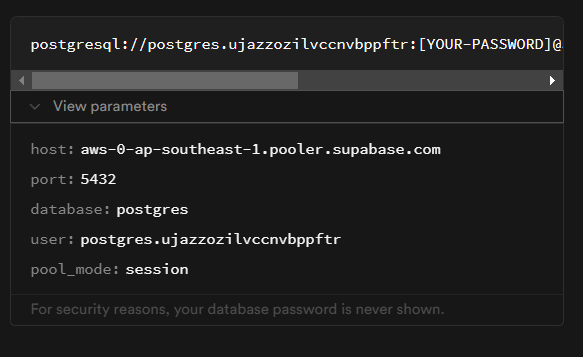
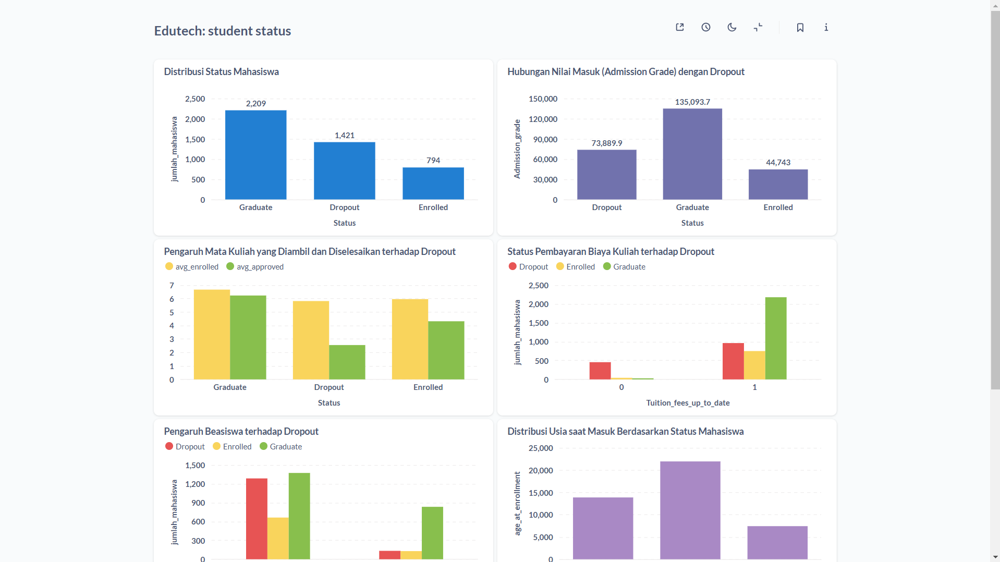
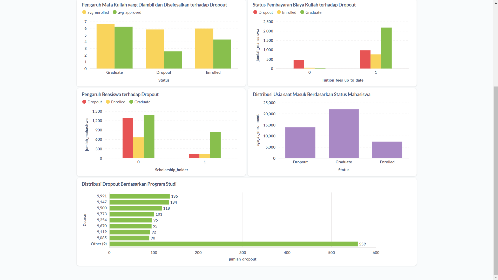
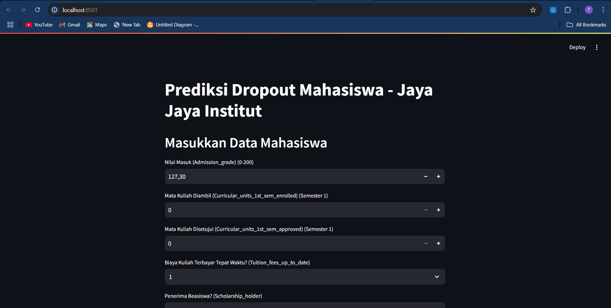
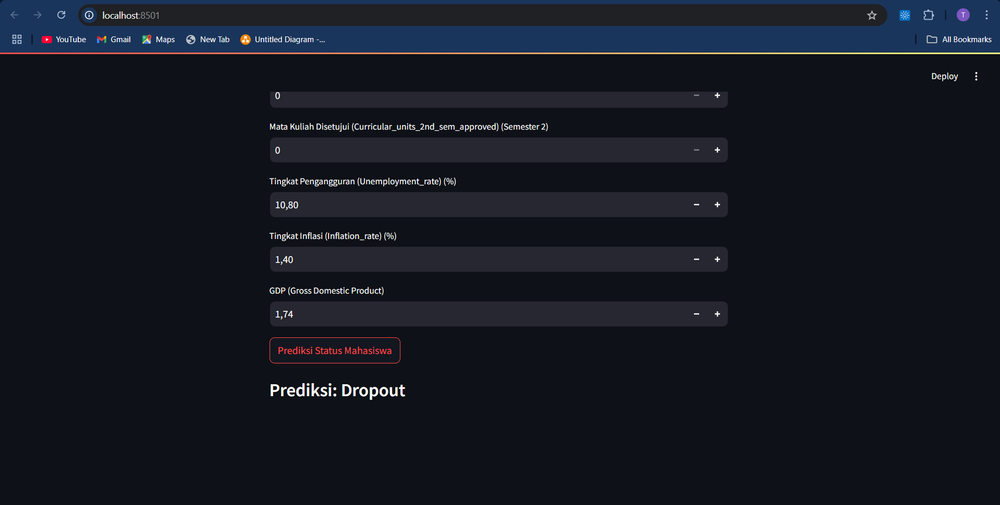

# Proyek Akhir: Menyelesaikan Permasalahan Perusahaan Edutech

## Business Understanding
Jaya Jaya Institut merupakan institusi pendidikan yang menghadapi tantangan besar dalam tingkat dropout mahasiswa. Tingginya angka dropout dapat berdampak buruk pada reputasi institusi dan kepercayaan masyarakat terhadap kualitas pendidikan yang diberikan. Oleh karena itu, diperlukan sistem yang dapat membantu mendeteksi mahasiswa yang berisiko dropout sedini mungkin agar intervensi yang tepat dapat dilakukan.

### Permasalahan Bisnis
Perusahaan ingin mengidentifikasi berbagai faktor yang mempengaruhi tingkat droput siswa sehingga dapat mengambil langkah-langkah strategis untuk mengurangi angka tersebut. Berikut adalah beberapa pertanyaan bisnis utama:

1. Bagaimana hubungan antara nilai masuk (Admission Grade) dengan kemungkinan dropout?
2. Bagaimana pengaruh jumlah mata kuliah yang diambil dan tingkat keberhasilannya terhadap dropout?
3. Apakah ada korelasi antara kondisi sosial-ekonomi (pendidikan orang tua, beasiswa, dan status pembayaran biaya kuliah) dengan dropout?
4. Bagaimana pengaruh usia saat masuk terhadap kemungkinan dropout?
5. Apakah ada tren dropout berdasarkan program studi tertentu?
6. Apa faktor penting dalam memonitor performa siswa atau mencegah dropout?

### Cakupan Proyek
- Melakukan **Exploratory Data Analysis (EDA)** untuk memahami pola dropout mahasiswa.
- Membuat **dashboard bisnis** untuk memvisualisasikan data secara interaktif.
- Mengembangkan **model machine learning** untuk memprediksi risiko dropout mahasiswa.
- Menyediakan **prototype berbasis Streamlit** untuk memudahkan pengguna dalam mengakses sistem prediksi.

### Persiapan

Sumber data: <a href="https://github.com/dicodingacademy/dicoding_dataset/blob/main/students_performance/README.md">students' performance</a> 


#### Setup environment:

#### Setup Environment - Anaconda
```
conda create --name main-ds python=3.9
conda activate main-ds
pip install -r requirements.txt
```

#### Setup Environment - Shell/Terminal
```
mkdir proyek_analisis_data
cd proyek_analisis_data
pipenv install
pipenv shell
pip install -r requirements.txt
```

### Melakukan Upload Dataset ke Supabase

- Pastikan sudah membuat akun <a href="https://supabase.com/dashboard/sign-in?">Supabase</a>.
- Jika sudah, klik `New Project`
- Lakukan pengisian form sesuai dengan keinginanmu, namun pastikan bahwa password mudah diingat atau perlu disalin di notepad.
- jika sudah kamu, klik `Create New Project`. Tunggu sampai proses build selesai.
- Setelah itu klik Project Setting -> Database
- Lakukan copy Cennection String URL (biasanya menggunakan session pooler jika menggunakan internet ipv4)
- Paste pada notebook bagian `Mengupload dataset ke supabase`, ganti [Your Password] dengan password yang kamu masukkan tadi.
- Lakukan run notebook dari awal hingga bagian  `Mengupload dataset ke supabase`. Pastikan dapat berjalan dengan baik.

### Menghubungkan Database Supabase ke Metabase dengan Docker

- Pastikan aplikasi <a href="https://www.docker.com/products/docker-desktop/" target="_blank">Docker</a> yang sudah terinstall atau kamu dapat melakukan install terlebih dahulu.
- Jika sudah terinstall. Run command berikut:
``` bash
docker run -p 3000:3000 --name metabase metabase/metabase
```
- Halaman browser baru akan terbuka. Kemudian Klik Settings -> Admin settings -> Database -> Add database
- Masukkan informasi konfigurasi dari database yang sebelumnya telah dibuat.

    <!--  -->
    
- Jika sudah lengkap, klik `Save`.
- Kamu dapat membuat model, visualisasi, dan dashboard sesuai keinginanmu.


## Business Dashboard
Dashboard bisnis yang telah dibuat menyajikan berbagai visualisasi data yang membantu dalam memahami faktor-faktor yang mempengaruhi dropout mahasiswa. Dashboard ini memiliki beberapa fitur utama:

- **Distribusi Status Mahasiswa**: Menunjukkan jumlah mahasiswa yang Dropout, Enrolled, dan Graduate.
- **Hubungan Nilai Masuk dengan Dropout**: Visualisasi ini membantu melihat apakah ada korelasi antara nilai masuk mahasiswa dan kemungkinan dropout.
- **Analisis Mata Kuliah yang Diambil dan Diselesaikan**: Memantau jumlah mata kuliah yang diambil dan diselesaikan mahasiswa untuk melihat pola akademik yang terkait dengan dropout.
- **Status Pembayaran Biaya Kuliah**: Membantu memahami apakah ada hubungan antara keterlambatan pembayaran biaya kuliah dengan risiko dropout.
- **Pengaruh Beasiswa terhadap Dropout**: Menganalisis apakah mahasiswa yang menerima beasiswa memiliki tingkat kelulusan yang lebih tinggi dibandingkan dengan yang tidak.
- **Distribusi Dropout Berdasarkan Program Studi**: Melihat program studi mana yang memiliki tingkat dropout tertinggi untuk memberikan rekomendasi perbaikan.

Dashboard ini dibuat menggunakan Metabase dan memungkinkan pengguna untuk melakukan eksplorasi data secara interaktif untuk mendapatkan insight yang lebih dalam.




Dashboard telah dibuat untuk memvisualisasikan faktor-faktor yang mempengaruhi dropout mahasiswa. Dashboard ini memungkinkan pengguna untuk:
- Melihat distribusi status mahasiswa (Dropout, Enrolled, Graduate).
- Menganalisis hubungan antara nilai masuk dengan kemungkinan dropout.
- Mengamati pola pembayaran biaya kuliah dan dampaknya terhadap dropout.
- Mengeksplorasi tren dropout berdasarkan program studi.


## Menjalankan Sistem Machine Learning
Sistem machine learning yang telah dikembangkan memungkinkan pengguna untuk memprediksi kemungkinan dropout mahasiswa berdasarkan input parameter akademik dan sosial-ekonomi. Model ini telah diintegrasikan ke dalam aplikasi berbasis Streamlit yang memungkinkan interaksi langsung dengan pengguna.

### **Fitur dalam Prototype Streamlit (`prototype.py`)**
- **Input Data Mahasiswa**: Pengguna dapat memasukkan berbagai informasi akademik dan sosial-ekonomi mahasiswa seperti nilai masuk, jumlah mata kuliah yang diambil, status pembayaran biaya kuliah, status penerima beasiswa, dan sebagainya.
- **Prediksi Dropout**: Setelah memasukkan data, sistem akan melakukan normalisasi input menggunakan `scaler.pkl` dan memprediksi apakah mahasiswa cenderung Dropout, Enrolled, atau Graduate menggunakan model machine learning yang telah dilatih (`final_dropout_prediction_model.pkl`).
- **Visualisasi Hasil Prediksi**: Hasil prediksi ditampilkan langsung dalam interface Streamlit sehingga pengguna dapat melihat status mahasiswa yang diprediksi.




### **Cara menjalankan prototype secara lokal:**

```bash
# Jalankan aplikasi Streamlit
streamlit run prototype.py
```

**Link akses prototype online:** [Prototype Prediksi Dropout Mahasiswa](https://dropoutstudentclassification-prototype.streamlit.app/)

## Conclusion
Dari hasil analisis dan implementasi model machine learning, ditemukan bahwa faktor utama yang berpengaruh terhadap dropout mahasiswa meliputi:
- Nilai masuk yang rendah.
- Jumlah mata kuliah yang diambil dan diselesaikan.
- Status pembayaran biaya kuliah.
- Usia saat pendaftaran.
- Status penerima beasiswa.

Dengan adanya **dashboard bisnis** dan **sistem prediksi berbasis machine learning**, pihak institusi dapat dengan mudah mengidentifikasi mahasiswa yang berisiko dropout dan mengambil tindakan intervensi lebih dini.

### Rekomendasi Action Items
- Mengembangkan program mentoring atau bimbingan bagi mahasiswa dengan nilai masuk rendah.
- Memberikan fleksibilitas pembayaran bagi mahasiswa dengan kesulitan keuangan.
- Menyediakan beasiswa tambahan untuk mahasiswa yang memiliki risiko tinggi dropout.
- Meningkatkan layanan akademik dan dukungan kepada mahasiswa tahun pertama.
- Menggunakan hasil prediksi machine learning sebagai bagian dari sistem monitoring mahasiswa.

